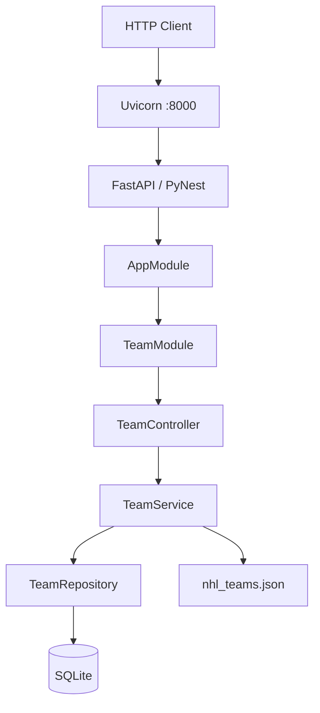

# 🏒 NHL API PyNest

**Version:** 1.0.0 <br/>
**Author:** Joseph Adogeri <br/>
**Date:** June 2026

> Browse, manage, and seed all 30 NHL teams — built with PyNest, FastAPI, and SQLAlchemy.

---

## 📋 Table of Contents

<ul>
  <li><a href="#1-introduction">1. Introduction</a>
    <ul>
      <li><a href="#11-purpose">1.1 Purpose</a></li>
      <li><a href="#12-scope">1.2 Scope</a></li>
      <li><a href="#13-intended-audience">1.3 Intended Audience</a></li>
    </ul>
  </li>
  <li><a href="#2-api-reference">2. API Reference</a></li>
  <li><a href="#3-system-architecture">3. System Architecture</a>
    <ul>
      <li><a href="#31-high-level-architecture">3.1 High-Level Architecture</a></li>
      <li><a href="#32-technology-stack">3.2 Technology Stack</a></li>
      <li><a href="#33-folder-structure">3.3 Folder Structure</a></li>
    </ul>
  </li>
  <li><a href="#4-data-design">4. Data Design</a>
    <ul>
      <li><a href="#41-entities">4.1 Entities and Relationships</a></li>
      <li><a href="#42-schema">4.2 Database Schema</a></li>
    </ul>
  </li>
  <li><a href="#5-installation">5. Installation</a></li>
  <li><a href="#6-configuration">6. Configuration</a></li>
  <li><a href="#7-usage">7. Usage</a></li>
  <li><a href="#8-auto-seeding">8. Auto-Seeding</a></li>
  <li><a href="#9-bugs-fixed-and-lessons-learned">9. Bugs Fixed &amp; Lessons Learned</a></li>
  <li><a href="#10-license">10. License</a></li>
</ul>

---

<a id="1-introduction"></a>
## **1. Introduction**

<a id="11-purpose"></a>
### **1.1 Purpose**

NHL API PyNest is a REST API for managing and querying NHL team data. It provides a clean, module-based service built with PyNest — a NestJS-inspired framework for Python — backed by FastAPI and a SQLite database. On first start, the database is automatically seeded from the bundled `nhl_teams.json` fixture so the API is ready to query immediately.

<a id="12-scope"></a>
### **1.2 Scope**

The system allows consumers to:

- List all 30 NHL teams, optionally filtered by conference or division.
- Retrieve a single team by its database ID.
- Create, update, and delete team records.
- Trigger a bulk-populate from the bundled JSON fixture or truncate the table entirely.
- Explore all endpoints interactively via the auto-generated FastAPI Swagger UI (`/docs`).

<a id="13-intended-audience"></a>
### **1.3 Intended Audience**

Backend developers, Python/FastAPI engineers, and technical reviewers evaluating the PyNest module pattern, SQLAlchemy integration, and REST API design.

---

<a id="2-api-reference"></a>
## **2. API Reference**

All routes are prefixed with `/teams`. The interactive Swagger UI is available at `http://127.0.0.1:8000/docs`.

### Teams — `/teams`

| Method | Route | Description |
|--------|-------|-------------|
| `GET` | `/teams/` | List all teams; supports `?conference=` and `?division=` filters |
| `GET` | `/teams/{team_id}` | Get a single team by ID |
| `POST` | `/teams/` | Create a new team record |
| `PUT` | `/teams/{team_id}` | Update an existing team |
| `DELETE` | `/teams/{team_id}` | Delete a team by ID |
| `POST` | `/teams/populate` | Bulk-populate from `nhl_teams.json` (skips duplicates) |
| `POST` | `/teams/truncate` | Delete all team records from the database |

#### `GET /teams/` — optional query parameters

| Query Param | Type | Description |
|-------------|------|-------------|
| `conference` | string | Filter by conference (e.g. `Eastern`, `Western`) |
| `division` | string | Filter by division (e.g. `Atlantic`, `Pacific`) |

#### `POST /teams/` — request body

```json
{
  "name": "Seattle Kraken",
  "city": "Seattle",
  "state": "WA",
  "conference": "Western",
  "division": "Pacific",
  "stadium": "Climate Pledge Arena"
}
```

#### `PUT /teams/{team_id}` — request body (all fields optional)

```json
{
  "stadium": "Updated Arena Name"
}
```

---

<a id="3-system-architecture"></a>
## **3. System Architecture**

<a id="31-high-level-architecture"></a>
### **3.1 High-Level Architecture**

```
┌─────────────────────────────────────────────────────┐
│              HTTP Client / Browser                  │
└───────────────────────┬─────────────────────────────┘
                        │ :8000
            ┌───────────▼────────────┐
            │   Uvicorn / FastAPI    │
            │   (PyNest bootstrap)   │
            └───────────┬────────────┘
                        │
          ┌─────────────▼──────────────┐
          │        AppModule           │
          │  ┌─────────────────────┐   │
          │  │    TeamModule       │   │
          │  │  Controller         │   │
          │  │  Service            │   │
          │  │  Repository        │   │
          │  └────────┬────────────┘   │
          └───────────┼────────────────┘
                      │
              ┌───────▼────────┐
              │  SQLite DB     │
              │  (SQLAlchemy)  │
              └────────────────┘
```



<a id="32-technology-stack"></a>
### **3.2 Technology Stack**

| Layer | Technology | Notes |
|-------|-----------|-------|
| Language | Python | 3.10+ |
| API Framework | FastAPI | Auto-generated `/docs` and `/redoc` |
| Module System | PyNest (`pynest-api`) | NestJS-inspired DI and module pattern |
| ASGI Server | Uvicorn | Hot-reload in development |
| ORM | SQLAlchemy | Synchronous engine with SQLite |
| Database | SQLite | File-based; path set via `DATABASE_URL` |
| Validation | Pydantic | Request / response model validation |
| Data Seeding | JSON fixture | `nhl_teams.json` — 30 teams (as of 2016) |

<a id="33-folder-structure"></a>
### **3.3 Folder Structure**

```
nhl_api_pynest/
├── .env.sample              # Environment variable template
├── main.py                  # Entry point: schema creation, auto-seed, Uvicorn start
├── nhl_teams.json           # Seed fixture — 30 NHL teams
├── requirements.txt         # Python dependencies
└── src/
    ├── __init__.py
    ├── app_module.py        # Root PyNest module (wires TeamModule)
    ├── config/
    │   └── database.py      # SQLAlchemy engine, session factory, Base
    └── modules/
        └── team/
            ├── team_controller.py   # Route handlers
            ├── team_entity.py       # SQLAlchemy ORM model
            ├── team_model.py        # Pydantic request / response schemas
            ├── team_module.py       # PyNest module declaration
            ├── team_repository.py   # Database access layer
            └── team_service.py      # Business logic
```

---

<a id="4-data-design"></a>
## **4. Data Design**

<a id="41-entities"></a>
### **4.1 Entities and Relationships**

The application manages a single entity:

```
teams
```

No foreign-key relationships exist in the current version — the `teams` table is self-contained.

<a id="42-schema"></a>
### **4.2 Database Schema**

#### `teams`

| Column | Type | Constraints | Description |
|--------|------|-------------|-------------|
| `id` | INTEGER | PK, auto-increment, indexed | Internal record ID |
| `name` | VARCHAR | unique, indexed, NOT NULL | Full team name (e.g. `Boston Bruins`) |
| `city` | VARCHAR | NOT NULL | City where the team is based |
| `state` | VARCHAR | nullable | State or province (e.g. `MA`, `QC`) |
| `conference` | VARCHAR | NOT NULL | `Eastern` or `Western` |
| `division` | VARCHAR | NOT NULL | `Atlantic`, `Metropolitan`, `Central`, or `Pacific` |
| `stadium` | VARCHAR | nullable | Home arena name |

---

<a id="5-installation"></a>
## **5. Installation**

### Prerequisites

- Python 3.10 or higher
- `pip` package manager

### Steps

```bash
# 1. Clone the repository
git clone https://github.com/jadogeri/nhl_api_pynest.git
cd nhl_api_pynest

# 2. (Recommended) Create and activate a virtual environment
python -m venv .venv
source .venv/bin/activate   # Windows: .venv\Scripts\activate

# 3. Install dependencies
pip install -r requirements.txt

# 4. Copy the environment template
cp .env.sample .env
```

---

<a id="6-configuration"></a>
## **6. Configuration**

Create a `.env` file from `.env.sample` and set the following variables:

| Variable | Required | Default | Description |
|----------|:--------:|---------|-------------|
| `DATABASE_URL` | ☑ | `sqlite:///./national_hockey_league.db` | SQLAlchemy-compatible connection string |

> **SQLite note:** The default connection string creates a local `national_hockey_league.db` file in the project root. No external database server is required for development.

---

<a id="7-usage"></a>
## **7. Usage**

```bash
# Start the service — tables are created and auto-seeded on first run
python main.py

# Alternatively, start with Uvicorn directly (with hot-reload)
uvicorn "main:http_server" --host "0.0.0.0" --port "8000" --reload
```

Once the server is running:

- **Swagger UI** → `http://127.0.0.1:8000/docs`
- **ReDoc** → `http://127.0.0.1:8000/redoc`

---

<a id="8-auto-seeding"></a>
## **8. Auto-Seeding**

On every startup, `main.py` checks whether the `teams` table is empty. If it is, the 30 NHL teams from `nhl_teams.json` are loaded automatically — no manual step required.

```
🚀 Database is empty! Auto-populating NHL teams from JSON...
✅ Auto-population completed successfully.
```

If the table already contains records, the seed step is skipped:

```
📦 Database already contains records. Skipping auto-population.
```

To reset and re-seed:

```bash
# Truncate via API
curl -X POST http://127.0.0.1:8000/teams/truncate

# Restart the server — auto-seed will fire again
python main.py
```

---

<a id="9-bugs-fixed-and-lessons-learned"></a>
## **9. Bugs Fixed & Lessons Learned**

### Bugs Fixed

| # | Bug | Root Cause | Fix |
|---|-----|-----------|-----|
| 1 | `aiosqlite` / `greenlet` errors at startup | Original `DATABASE_URL` used the async driver (`sqlite+aiosqlite://`) but the repository uses synchronous SQLAlchemy sessions | Changed driver to standard `sqlite:///` and replaced the async engine with a synchronous `create_engine` + `sessionmaker` |
| 2 | `DetachedInstanceError` on update and delete | `db_team` objects were loaded in one session context and then used in a different one | Added `db.merge(db_team)` before any mutation to re-attach the detached instance to the current session |
| 3 | PyNest DI failing to resolve `TeamService` | PyNest requires an explicit `useFactory` key (camelCase) when using factory functions in `providers` | Registered `TeamService` with `{"provide": TeamService, "useFactory": team_service_factory, "inject": [TeamRepository]}` |
| 4 | `state` and `stadium` columns rejecting `NULL` | Both columns were declared `nullable=False` but several teams in the fixture omit one or both fields | Changed both columns to `nullable=True` in `TeamEntity` |

### Lessons Learned

- **PyNest DI wiring is strict**: Unlike NestJS, PyNest requires factory functions to be registered explicitly using the `useFactory` pattern. Relying on implicit constructor injection for classes with arguments fails silently or raises confusing errors at startup.
- **SQLAlchemy session boundaries**: Always keep session open for the full unit of work. Objects loaded in one `with session:` block become detached when that block exits — calling `db.merge()` is the safest way to re-attach them rather than re-querying.
- **Synchronous vs asynchronous SQLAlchemy**: Mixing an async driver (`aiosqlite`) with a synchronous `sessionmaker` causes `greenlet` runtime errors. Pick one model and stay consistent — for a simple CRUD API, the synchronous engine is simpler and avoids the `asyncio.run()` nesting issues that arise inside Uvicorn's event loop.

---

<a id="10-license"></a>
## **10. License**

MIT — see [LICENSE.md](./LICENSE.md).

---

<p align="center">
  Made with ❤️ for hockey fans everywhere
</p>
